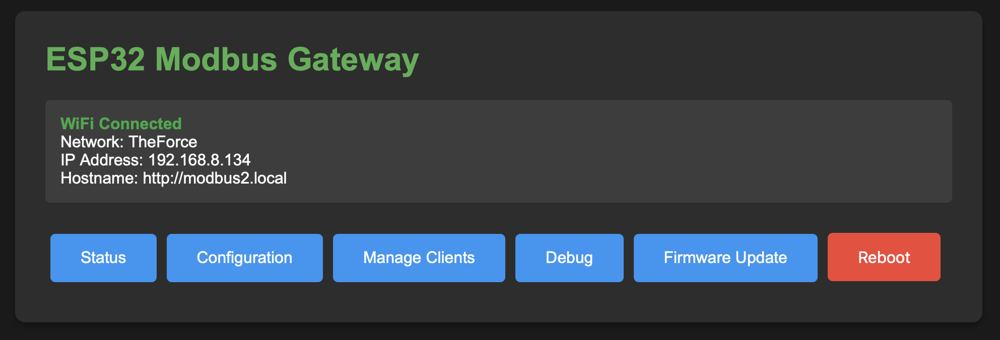
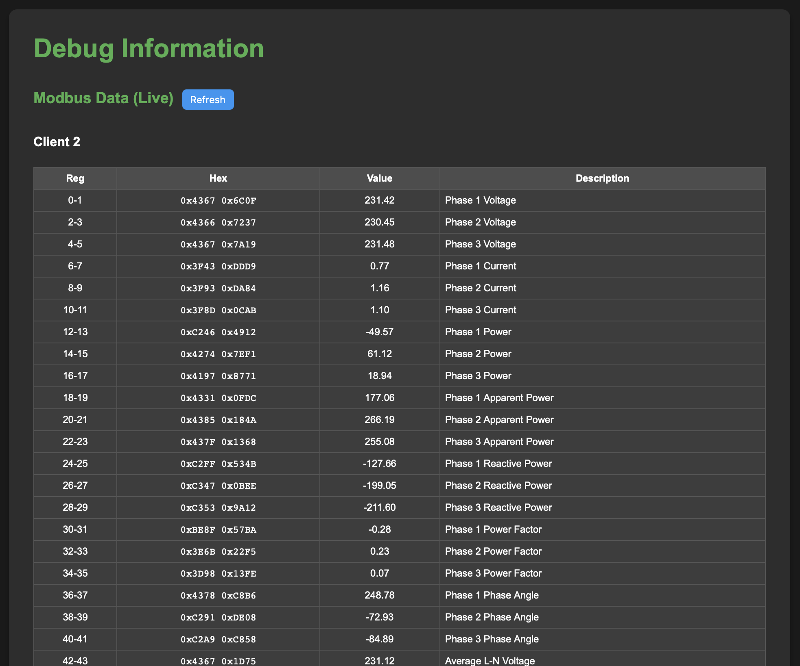
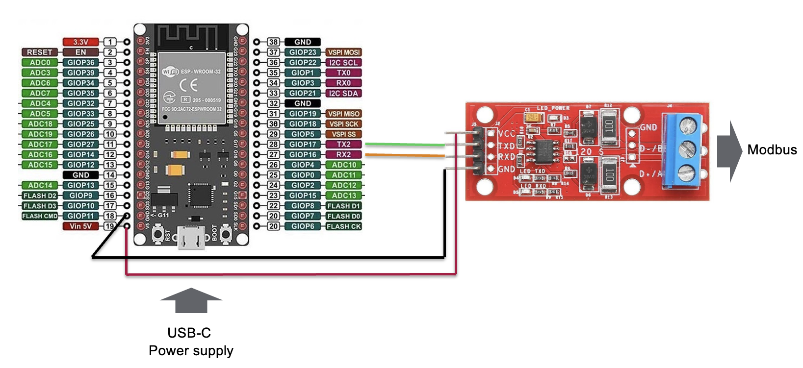

# ESP32 Modbus TCP Gateway

A DIY ESP32-based **Modbus TCP ↔ Modbus RTU gateway** that allows Modbus devices such as **energy meters** or **solar inverters** to be accessed by network devices (e.g. home servers, Homey Pro, SCADA systems, Home Assistant) over TCP/IP.

---

## Overview

This project runs on an ESP32 and bridges Modbus RTU devices to Modbus TCP clients over Wi-Fi.  
It includes a built-in web interface for configuration, diagnostics, and firmware updates, while maintaining reliable and uninterrupted Modbus communication.

---

## Software

- Arduino IDE firmware for **Espressif ESP32** devices  
- Source code included in this repository

---

## Features

### Modbus Support
- Tested and supported device (currently):
  - **Eastron SDM630**
- Configurable support for **multiple Modbus TCP clients**
- Reliable Modbus RTU polling and request handling

### Networking & Web Interface
- Starts in **Access Point mode** for easy initial Wi-Fi configuration
- Built-in HTTP web server:
  - Configuration portal
  - Debug and diagnostics pages
- **mDNS support** for easy discovery on the local network  
  - Access via: `http://modbus.local`
- **Service Discovery**
  - HTTP service (port 80)
  - Modbus TCP service (port 502)

### Performance & Stability
- **Dual-core load balancing** on ESP32:
  - **Core 1**
    - Wi-Fi connection management
    - HTTP web server
    - Web portal handling
  - **Core 0**
    - Modbus RTU communication
    - Modbus TCP server requests
    - RTU device polling
- Designed for a responsive web interface without interrupting Modbus traffic

### Maintenance & Reliability
- **Remote firmware updates**
- Persistent configuration storage for fast recovery
- Automatic error recovery:
  - Wi-Fi auto-reconnect (checked every 30 seconds)
  - Modbus retry logic:
    - 3 retries
    - 100 ms delay between retries
  - Statistics tracking:
    - Wi-Fi reconnect count
    - System errors
    - Per-slave Modbus errors

---

## Web Interface Screenshots

  
  

---

## Hardware Requirements

- **ESP32 development board** (ESP32-C or similar)
- **RS-485 to UART module**
  - MAX438 (or compatible)

### Wiring Diagram

---

## How to Build

### 1. Hardware Connections

Connect the RS-485 module to the ESP32 according to the diagram:

| RS-485 Module | ESP32 |
|---------------|-------|
| Vcc           | Vin   |
| GND           | GND   |
| TX            | TX (GPIO 17) |
| RX            | RX (GPIO 16) |

### 2. Modbus Device Connection

- Connect **A** and **B** from the Modbus device to the RS-485 module  
- For short cable distances:
  - No termination resistor required
  - No additional ground required

### 3. Flash the Firmware

1. Connect the ESP32 to your computer via USB  
2. Open the project in **Arduino IDE**  
3. Compile and upload the firmware

### 4. First Startup

1. Power up the ESP32  
2. Connect to the temporary Wi-Fi Access Point  
3. Open the web interface to configure:
   - Wi-Fi credentials
   - Modbus settings

### 5. Use the Gateway 🚀

- Access the device via `http://modbus.local`
- Connect Modbus TCP clients on port **502**
- Monitor live data via the debug page

---

## License

This project is intended for DIY and educational use.  
See the repository for licensing details.

